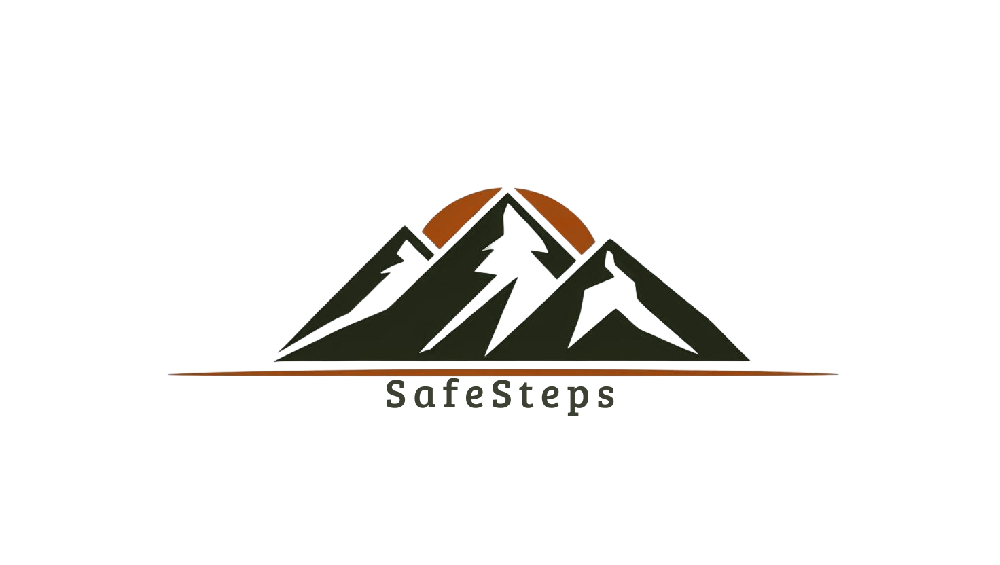

<p align="center">
  
</p>

<h1 align="center">SafeSteps</h1>

<p align="center">
  🥾 Tu compañero inteligente para aventuras seguras en la montaña.
</p>

---

## 🌄 ¿Qué es SafeSteps?

**SafeSteps** es una aplicación móvil desarrollada con **Ionic** y **Firebase**, diseñada para mejorar la experiencia de senderismo al proporcionar herramientas útiles y características esenciales para los entusiastas del aire libre.

Ya sea que estés explorando una nueva ruta o planificando tu próxima caminata, SafeSteps te acompaña en cada paso.

---

## 🚀 Características principales

- 🧭 **Navegación de rutas seguras**
- 🛰️ **Seguimiento en tiempo real con GPS**
- 📍 **Marcadores de puntos de interés**
- 🤝 **Compartir ubicación con contactos de confianza**
- 🏕️ **Modo offline para rutas sin conexión**

---

## 🛠️ Tecnologías utilizadas

- **[Ionic Framework](https://ionicframework.com/)** – para una interfaz móvil atractiva y multiplataforma.
- **[Firebase](https://firebase.google.com/)** – para autenticación, base de datos en tiempo real, y más.
- **Capacitor** – para acceder a funciones nativas como GPS y almacenamiento.

---

## 📲 Instalación rápida

```bash
git clone https://github.com/Ogiwara-unu/SafeSteps.git
cd SafeSteps
npm install
ionic serve
